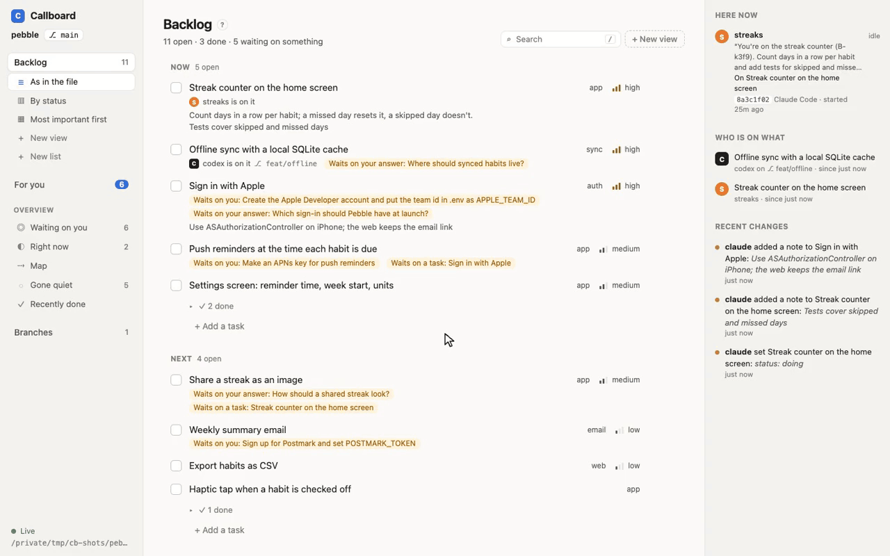
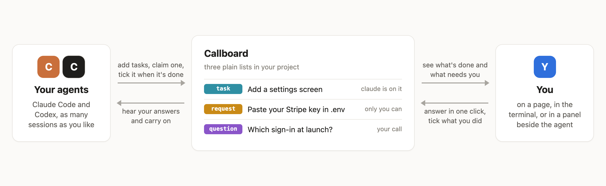
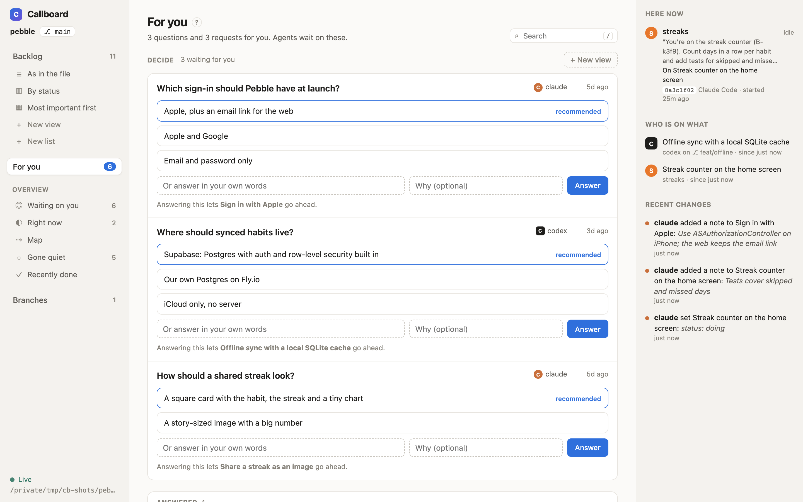
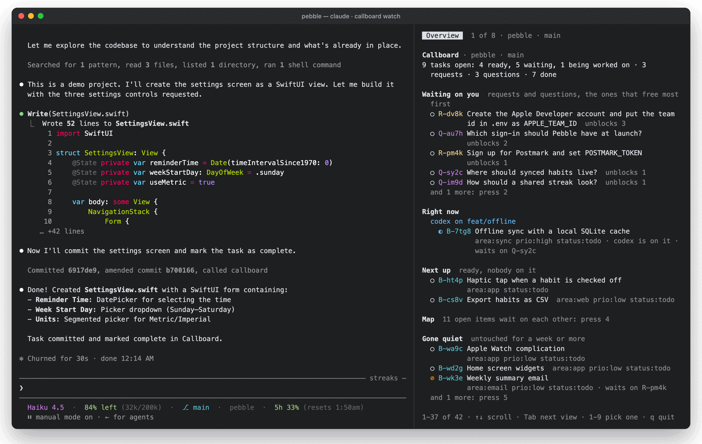

# Callboard

**A shared to-do list for you and your AI coding agents.**

When Claude Code or Codex works on your project, Callboard keeps its plan where you can see it: what's being done, by whom, and what's waiting on you. Agents bring you their questions with options and a recommendation, and list the things only you can do (an API key, an account, a deploy) with exact steps. You answer in one click, and the agent carries on.

<picture>
  <source media="(prefers-color-scheme: dark)" srcset="docs/images/clip-live-dark.gif">
  
</picture>

## Why

- **See what your agents are doing.** Stop scrolling back through a chat to find out what's done and what's next. It's all in one list, updated as they work.
- **They ask, you decide.** Decisions that are yours come to you as questions, with the options and the agent's recommendation. If an agent can't wait, it goes ahead with its best guess, and redoes the work if you pick something else.
- **Know what's holding things up.** "Waiting on you" shows what only you can do, starting with whatever frees the most work.
- **Several agents, no collisions.** Claude Code and Codex, several sessions, several branches: each agent claims a task before starting it, so no two do the same work.
- **Just files in your project.** Three Markdown checklists you can read on GitHub or edit by hand. No account, no server, no cloud.

<picture>
  <source media="(prefers-color-scheme: dark)" srcset="docs/images/how-it-works-dark.png">
  
</picture>

## Get started

**1. Install** (macOS or Linux; for Windows, see [setup](docs/setup.md)):

```bash
curl -fsSL https://raw.githubusercontent.com/AsWali/CallBoard/main/install.sh | sh
```

**2. Connect your agents,** once for all your projects:

```bash
callboard setup --global
```

Or just for one project: run `callboard setup` inside it. That writes the settings into the project itself, so you can commit them and your teammates get them too ([more](docs/setup.md#set-up-one-repo-for-a-team)).

**3. Work as usual.** Open Claude Code or Codex in any project and ask for something. The agent keeps its plan in Callboard by itself.

**4. See the lists:**

```bash
callboard serve --open      # the page, in your browser
```

Or type `/callboard` in Claude Code (`!callboard` in Codex) to see them in the conversation.

## What you'll see

Answer questions on the page, with the agent's recommendation marked and what each answer frees:

<picture>
  <source media="(prefers-color-scheme: dark)" srcset="docs/images/page-foryou-dark.png">
  
</picture>

See a list your way: a board by status, a table with the most important first, or only what's blocked. Ask your agent ("show the backlog as a board by status") or click **+ New view**. Drag a card to another column to change it, and everyone, agents included, sees the same views ([more](docs/page.md#views)):

<picture>
  <source media="(prefers-color-scheme: dark)" srcset="docs/images/clip-board-dark.gif">
  
</picture>

Agents suggest views too, when they think a list would read better another way. Preview it, then keep it or dismiss it:

<picture>
  <source media="(prefers-color-scheme: dark)" srcset="docs/images/clip-suggest-dark.gif">
  
</picture>

In your terminal, keep the lists beside the agent with `/callboard panel`:



## Try it on a demo project

```bash
git clone https://github.com/AsWali/CallBoard && cd CallBoard
scripts/demo.sh                  # makes a made-up app, Pebble, in $TMPDIR/callboard-demo/pebble
cd "${TMPDIR:-/tmp}/callboard-demo/pebble"
callboard serve --open
```

Then start `claude` or `codex` in that folder and ask it to pick up the next task. You'll see it claim one, and tick it when it's done.

## Docs

- [Questions people ask](docs/faq.md): do I need git, does it cost tokens, what if I don't answer
- [Install and set up](docs/setup.md): Windows, one repo for a team, what setup changes, switching it off
- [The page](docs/page.md): For you, the Map, views, boards and tables, your own fields, branches
- [In the terminal](docs/terminal.md): `/callboard`, the panel, the status line
- [How agents use it](docs/agents.md): what they hear, claims, notes, versions, assumed answers
- [Git and branches](docs/git.md): item-by-item merging, conflicts, worktrees
- [The files](docs/files.md): the format, subtasks, your own lists, answers, fields, views
- [Commands and MCP tools](docs/commands.md): every command, the words for `/callboard`, environment variables
- [Page API](docs/api.md): the page's JSON API, for scripts
- [Working on Callboard](docs/development.md): the code, tests and releases

Callboard is one Go program. It works on macOS, Linux and Windows, with Claude Code and Codex. [MIT license](LICENSE).
