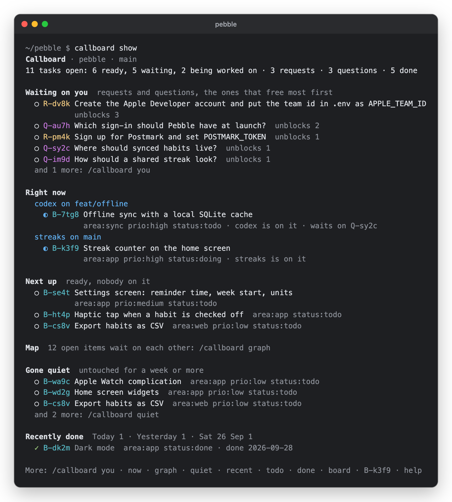

# In the terminal

[← Back to the README](../README.md)

## /callboard

Type `/callboard` in Claude Code to see the lists right in the conversation. Callboard answers it before the model sees it, so it costs no tokens and takes no turn. `callboard show` prints the same in any terminal.

Words after it narrow it down, and they combine: `/callboard you`, `now`, `graph`, `quiet`, `recent`, `todo prio=high`, `requests done`, `board by:prio`, a key like `B-k3f9` for one item, or any other word to search. See the [full list of words](commands.md#words-for-callboard).

Codex has no custom slash commands, so there you type `!callboard …` instead.

## The panel

`callboard panel` keeps the lists open beside the agent, and draws them again whenever they change. Type `/callboard panel` in Claude Code, or `!callboard panel` in Codex.

It splits the window where the terminal allows it: tmux, Zellij, iTerm2, WezTerm, Kitty (with `allow_remote_control yes`) and Windows Terminal. Elsewhere it opens a window beside this one. In macOS Terminal, it narrows the agent's window to make room and puts it back afterwards. Focus stays with the agent.

Tabs along the top hold the five views and your saved views:
- Tab or 1–9 switches views;
- the arrows scroll;
- q closes the panel.

In a narrow panel, long titles wrap and the hints name the key to press.

`callboard watch [WORDS]` is the same screen, for any split or window you open yourself.

## The status line

`callboard statusline on` puts a Callboard line in Claude Code's status line. It shows:
- what this session is on;
- how many requests and questions are waiting for you;
- how many tasks are ready, and the next one.

It's opt-in: setup never turns it on. If you have a status line of your own, Callboard leaves it alone unless you add `--below`, which keeps yours and puts Callboard's under it. `callboard statusline off` puts things back as they were.

Codex's status line only takes its own built-in items, so use the panel there.
